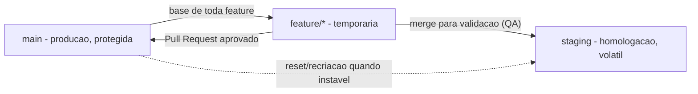

# Guia de Estudos: Git e Fluxo Git SMN (Horizonte Sistemas)

Bem-vindo ao guia de estudos do módulo de Git. Todo o material prático utiliza o cenário da **Horizonte Sistemas**, uma software house fictícia cujo squad desenvolve o **AgendaFácil**, um sistema de agendamento online. Você aprenderá o Git como ele é usado no dia a dia de um time de desenvolvimento.

## O Fluxo Git SMN em um Diagrama

Observação importante: **não existe** seta de `staging` para `main` — esse merge é vedado pelo fluxo SMN.

### Regras do Fluxo (as regras de negócio deste módulo)

1. `main` é a produção: protegida, recebe alterações somente via Pull Request aprovado.
2. `staging` é a homologação: volátil, pode ficar instável e ser recriada a partir da `main` a qualquer momento.
3. `feature/*` é temporária: nasce sempre da `main` atualizada e é excluída após a entrega.
4. Correções de problemas encontrados na homologação são feitas **na feature**, nunca diretamente na `staging`.
5. É **vedado** o merge de `staging` para `main`.

## Cronograma

*   **[Aula 1: Git Essencial e o Fluxo Git SMN](aula1-git-e-fluxo-smn.md)**
    *   O que é versionamento; `init`, `clone` e `status`.
    *   O ciclo `add`, `commit`, `log` e `diff`.
    *   Remotos: `origin`, `push`, `pull` e `fetch`.
    *   Branches, `merge`, fast-forward e resolução de conflitos.
    *   O fluxo Git SMN: `main`, `staging` e `feature/*` nas 3 fases.
    *   Comparativo Gitflow tradicional vs. Gitflow SMN.
    *   _Estudo de Caso: o ciclo completo da feature "lembrete por e-mail" do AgendaFácil._

Após concluir a leitura, resolva a lista de exercícios em [../exercicios/aula1-exercicios.md](../exercicios/aula1-exercicios.md).
