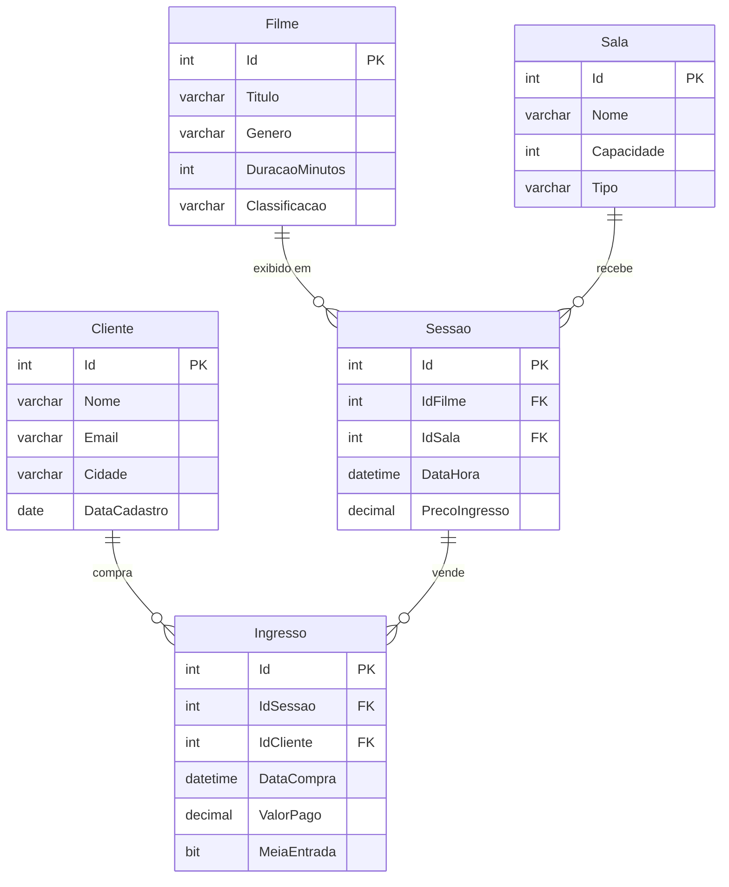

# Guia de Estudos: SQL Básico (CineVista)

Bem-vindo ao guia de estudos do módulo de SQL Básico. Todo o material prático utiliza o cenário da **CineVista**, uma rede de cinemas fictícia que administra filmes em cartaz, salas de exibição, sessões e venda de ingressos.

## O Banco de Dados CineVista

O diagrama abaixo mostra as 5 tabelas do banco `cinevista` e seus relacionamentos. Ele serve apenas como **mapa de leitura** do banco pronto — modelagem de dados (ER e normalização) é assunto de outro módulo.

### Regras de Negócio da CineVista

1. Cada **sessão** exibe um único filme, em uma única sala, com data/hora e preço de ingresso próprios.
2. Cada **ingresso** vincula um cliente a uma sessão e registra o valor efetivamente pago.
3. Ingressos de **meia-entrada** custam 50% do preço da sessão (`MeiaEntrada = 1`).
4. A **ocupação** de uma sessão é a comparação entre ingressos vendidos e a capacidade da sala.
5. Salas possuem tipos diferentes (`2D`, `3D`, `IMAX`), e o preço das sessões costuma acompanhar o tipo da sala.

## Como Inicializar o Banco

Execute os scripts na ordem abaixo, no SQL Server Management Studio (SSMS):

1. [database/criar_banco.sql](database/criar_banco.sql) — cria o banco `cinevista` e as 5 tabelas.
2. [database/popular_banco.sql](database/popular_banco.sql) — insere a massa de dados usada nas aulas e exercícios.

## Cronograma

*   **[Aula 1: SQL Básico no SQL Server — do CREATE ao SELECT](aula1-sql-basico-consultas.md)**
    *   Categorias de comandos (DDL, DML, DQL) e tipos de dados.
    *   DDL: `CREATE`, `ALTER`, `DROP`, chaves primárias e estrangeiras.
    *   DML: `INSERT`, `UPDATE`, `DELETE`.
    *   `SELECT`, `WHERE`, `ORDER BY`, `DISTINCT`, `TOP`, `LIKE`, `BETWEEN`, `IN`.
    *   Funções de agregação, `GROUP BY` e `HAVING`.
    *   JOINs (`INNER`, `LEFT`, `RIGHT`).
    *   _Estudo de Caso: relatório de bilheteria e análise de clientes da CineVista._

Após concluir a leitura, resolva a lista de exercícios em [../exercicios/aula1-exercicios.md](../exercicios/aula1-exercicios.md).
